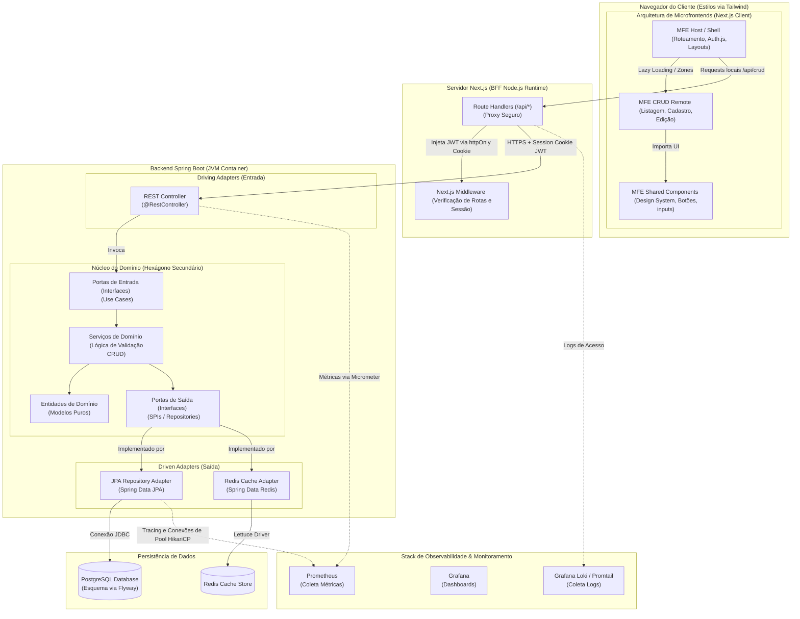
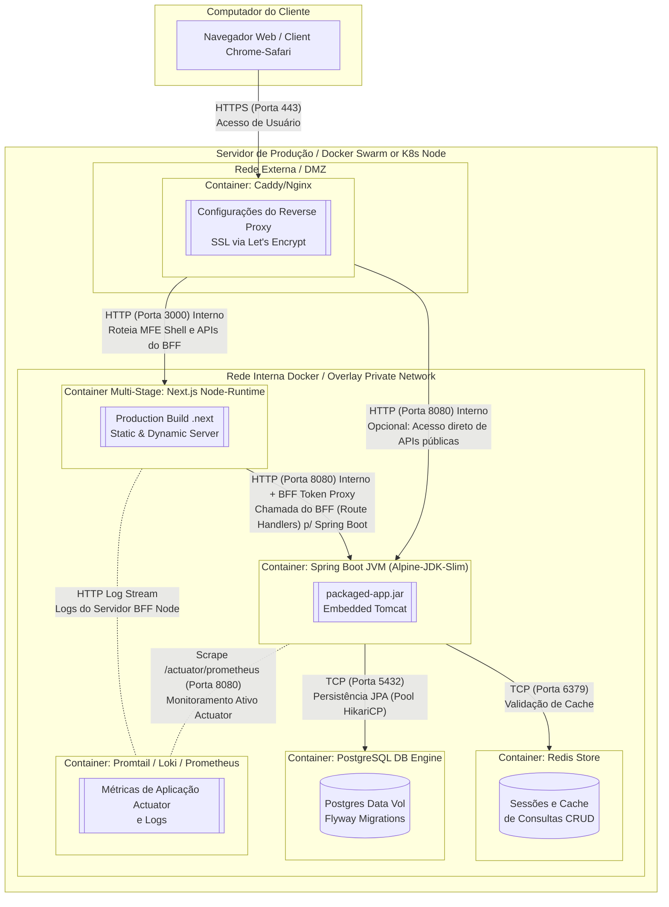

### 1. Diagrama de Componentes (Component Diagram)

Este diagrama ilustra a divisão física e lógica do ecossistema. No frontend, adotamos um padrão de **Microfrontends baseado em Next.js (Multi-Zone/Module Federation)** com um **BFF (Backend for Frontend)** integrado. No backend, mapeamos as fronteiras do **Hexágono** do Spring Boot.

---

### 2. Diagrama de Classes (Class Diagram)

Este diagrama representa a implementação clássica das classes de uma entidade de negócio (ex: `Product`) no backend usando a **Arquitetura Hexagonal**, conectada à tipagem do Frontend para manter o **Type Safety**.

```mermaid
classDiagram
    %% --- FRONTEND TYPING (TypeScript) ---
    class ProductTS {
        <<interface>>
        +id: string
        +name: string
        +price: number
        +quantity: number
        +createdAt: string
    }

    class ProductCreateInputTS {
        <<interface>>
        +name: string
        +price: number
        +quantity: number
    }

    %% --- BACKEND DOMAIN CORE ---
    class Product {
        -UUID id
        -String name
        -BigDecimal price
        -Integer quantity
        -Instant createdAt
        +Product(UUID id, String name, BigDecimal price, Integer quantity)
        +getId() UUID
        +getName() String
        +getPrice() BigDecimal
        +getQuantity() Integer
        +getCreatedAt() Instant
        +validate() void
    }

    %% --- INBOUND PORTS (Interfaces de Caso de Uso) ---
    class ManageProductUseCase {
        <<interface>>
        +createProduct(ProductCreateCommand command) Product
        +getProductById(UUID id) Product
        +updateProduct(UUID id, ProductUpdateCommand command) Product
        +deleteProduct(UUID id) void
    }

    class ProductCreateCommand {
        -String name
        -BigDecimal price
        -Integer quantity
        +ProductCreateCommand(String name, BigDecimal price, Integer quantity)
        +getName() String
        +getPrice() BigDecimal
        +getQuantity() Integer
    }

    %% --- DOMAIN SERVICES (Implementações do Caso de Uso) ---
    class ProductDomainService {
        -ProductDatabasePort databasePort
        +ProductDomainService(ProductDatabasePort databasePort)
        +createProduct(ProductCreateCommand command) Product
        +getProductById(UUID id) Product
        +updateProduct(UUID id, ProductUpdateCommand command) Product
        +deleteProduct(UUID id) void
    }

    %% --- OUTBOUND PORTS (Interfaces de Persistência / SPI) ---
    class ProductDatabasePort {
        <<interface>>
        +save(Product product) Product
        +findById(UUID id) Optional~Product~
        +delete(UUID id) void
        +existsById(UUID id) boolean
    }

    %% --- INBOUND ADAPTERS (REST Controllers & DTOs) ---
    class ProductRestController {
        -ManageProductUseCase useCase
        +ProductRestController(ManageProductUseCase useCase)
        +create(ProductRequestDTO dto) ResponseEntity~ProductResponseDTO~
        +getById(UUID id) ResponseEntity~ProductResponseDTO~
    }

    class ProductRequestDTO {
        -String name
        -BigDecimal price
        -Integer quantity
        +ProductRequestDTO()
        +getName() String
        +getPrice() BigDecimal
        +getQuantity() Integer
    }

    class ProductResponseDTO {
        -UUID id
        -String name
        -BigDecimal price
        -Integer quantity
        -Instant createdAt
        +ProductResponseDTO(UUID id, String name, BigDecimal price, Integer quantity, Instant createdAt)
        +getId() UUID
        +getName() String
        +getPrice() BigDecimal
        +getQuantity() Integer
        +getCreatedAt() Instant
    }

    %% --- OUTBOUND ADAPTERS (JPA Adapters & Entities) ---
    class ProductJpaAdapter {
        -SpringDataProductRepository repository
        +ProductJpaAdapter(SpringDataProductRepository repository)
        +save(Product product) Product
        +findById(UUID id) Optional~Product~
        +delete(UUID id) void
        +existsById(UUID id) boolean
    }

    class ProductJpaEntity {
        -UUID id
        -String name
        -BigDecimal price
        -Integer quantity
        -Instant createdAt
        +ProductJpaEntity()
        +ProductJpaEntity(UUID id, String name, BigDecimal price, Integer quantity)
        +getId() UUID
        +setId(UUID id) void
        +getName() String
        +setName(String name) void
    }

    class SpringDataProductRepository {
        <<interface>>
    }

    %% --- RELACIONAMENTOS ---
    ProductCreateInputTS ..> ProductTS : "Define base"
    ProductRestController ..> ProductRequestDTO : "Recebe payload"
    ProductRestController ..> ProductResponseDTO : "Retorna payload"
    ProductRequestDTO ..> ProductCreateCommand : "Converte para"
    
    ProductRestController --> ManageProductUseCase : "Usa"
    ProductDomainService ..|> ManageProductUseCase : "Implementa"
    ProductDomainService --> Product : "Manipula"
    ProductDomainService --> ProductDatabasePort : "Usa"
    
    ProductJpaAdapter ..|> ProductDatabasePort : "Implementa"
    ProductJpaAdapter --> SpringDataProductRepository : "Delega para"
    ProductJpaAdapter ..> ProductJpaEntity : "Converte de/para"
    ProductJpaEntity <.. SpringDataProductRepository : "Gerencia"
```

---

### 3. Diagrama de Implantação (Deployment Diagram)

Este diagrama detalha como a aplicação será hospedada, orquestrada, escalada de forma resiliente e conteinerizada através do **Docker/Docker Compose**. Ele inclui as barreiras de proteção de borda (**Caddy/Nginx**), a camada de aplicação isolada e a monitoração ativa.

---

### Detalhes Técnicos de Resiliência, Observabilidade e CRUD

1. **Resiliência (Backend & Frontend):**
   * **Spring Boot (Circuit Breaker):** Configuração de resiliência usando o *Resilience4j* encapsulando as consultas do banco de dados PostgreSQL. Se o banco apresentar picos de lentidão, o Circuit Breaker abre e respostas amigáveis ou dados em cache (oriundos do Redis) são retornados para a aplicação.
   * **BFF HTTP Retry & Timeout:** O Next.js Route Handler define tempos limite rigorosos (*timeouts*) em todas as requisições repassadas ao Spring Boot. Caso ocorra um erro de rede transitório `503`, o frontend executa tentativas automáticas de requisição (*retries* assíncronos) de forma invisível ao usuário.

2. **Observabilidade Completa:**
   * **Spring Boot Actuator + Micrometer:** Expõe métricas de saúde da aplicação (`/actuator/health`) e dados de desempenho do JVM para o Prometheus.
   * **Logs Estruturados (SLF4J + Logback):** Saída de logs em formato JSON padronizado no console, facilitando a captura automática por coletores como o *Promtail* ou *Fluentd* e indexação imediata no *Grafana Loki*.
   * **Tratamento Global de Exceções:** Implementado com `@RestControllerAdvice` para capturar exceções SQL, de validação e de segurança, evitando a exposição de dados sensíveis na resposta HTTP e registrando adequadamente o erro nos logs de observabilidade.

3. **Arquitetura de Microfrontends (Frontend):**
   * O **Next.js Host (Shell)** atua como orquestrador principal, sendo responsável por prover a folha de estilos global (Tailwind), gerenciar o estado da sessão de login via *Auth.js* e realizar o roteamento.
   * O **MFE CRUD (Remote)** é injetado sob demanda em páginas específicas (ex: `/produtos`), carregando em tempo de execução somente o JavaScript necessário para as listagens e mutações.
